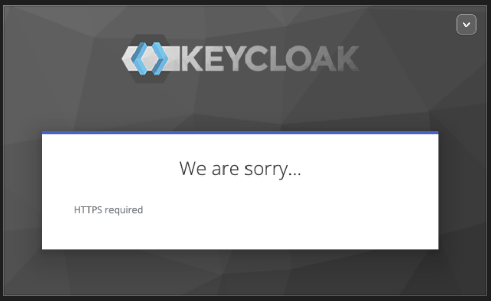
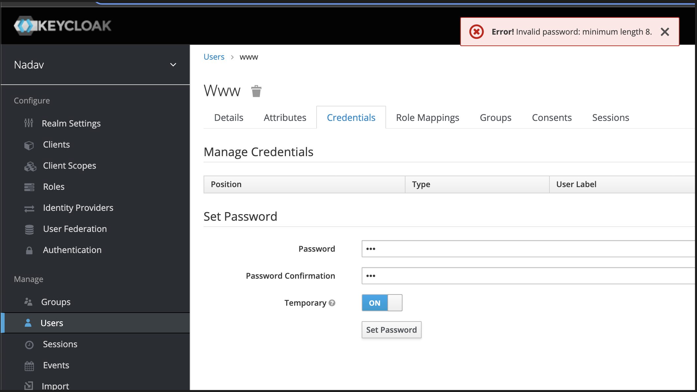

# keycloak-service

---


## Keycloak Automation Assignment 


### Technical Details
* You can choose any programming language of your choice for this assignment
* Same goes for any other tech you choose to leverage, the only thing you should stick to using is keycloak as the IDP
* The container image for keycloak that you should use is `jboss/keycloak:16.1.1`
* Your delivery should run locally without requiring access to external cloud assets


### Functional Requirements 

1. Data persistency - Make sure data is persistent, e.g if the keycloak container is paused, stopped or deleted, data will persist
2. Write an http service that can serve requests, with an endpoint that once invoked, create a realm in keycloak. Realm name should be passed to that endpoint as a required argument.
   - Realm names should be a valid subdomain (dns)
3. Should be able to create multiple realms (Create several realms)
4. We want to introduce and enforce a new password creation policy for all existing realms, how should we do it? you don’t have to
implement this step, but please provide your suggested design.


### DOD 
As a user I would like to run keycloak locally with ease, and be able to create new realms with ease, without having to log into the keycloak admin
panel.


---

The requested image to use for keycloak is based on linux/amd64 (I will fail to run on Apple Silicon Macs). For that reason, I created a dev infra with Terraform that creates an ubuntu 22_04-lts on Azure.

### Prerequisites    
* You must have Docker installed on your system for the delivery to run locally.
   I have  provisioned my infrastructure to include Docker using Ansible check it out under provision-infra:
   ```
      .
      ├── provision-infra
      │   ├── Install-Docker
      │   ├── Install-Docker-Compose
      │   ├── inventory.yaml
      │   ├── provision-infra.sh
      │   └── provision-infrastructure-playbook.yaml
   ```
* Make sure your system have the container image : `jboss/keycloak:16.1.1` by pulling the image or it will be pulled when running the  command
   ```
   docker pull jboss/keycloak:16.1.1
   ```


### Runtime configuration


The version `jboss/keycloak:16.1.1`  must run with HTTPS over port 8443, otherwise the `Administration Console` wount be accessible. 



Acording to the image doc at Docker Hub [jboss/keycloak ](https://hub.docker.com/r/jboss/keycloak)  can run securly by mount `tls.crt` `tls.key` 
file to the path : `/etc/x509/https` inside the container.
I created a self-singed certificets placed unde certificates dir.

If you would like to generate the pair yourself run :
``` 
openssl req -newkey rsa:2048 -nodes \
  -keyout tls.key -x509 -days 3650 -out tls.crt
```


Data persistency - By default, Keycloak is using its embedded H2 database. The default database is located in /opt/jboss/keycloak/standalone/data/ the name is keycloak.mv.db
At runtime a volume map correspondly : ```./h2-data/:/opt/jboss/keycloak/standalone/data/```


An http service develope using Python Flask.

Directory structure :
```
service/
├── __init__.py
├── __pycache__
│   ├── __init__.cpython-310.pyc
│   └── main.cpython-310.pyc
├── blueprints
│   ├── __init__.py
│   ├── __pycache__
│   └── realm_operation_blueprint.py
├── bootstrap.sh
├── main.py
├── model
│   ├── __init__.py
│   ├── __pycache__
│   └── realm.py
└── 
```


### create a realm in KeyCloak
I decided to implement the HTTP `python-keycloak` a package providing access to the Keycloak API.
Initially, I thought to implement a direct call to the rest API and even implemented a method to get an admin access token.

Eventually, I when with the client library to keep the code cleaner, with the price of fewer generics operations.
For the DOD it is defiantly enough.

I used `marshmallow` for simplified object serialization.

Even though thou my main Object the Realm has one attribute it helps handle multiple deserialize and schema validation.
```python
from marshmallow import Schema, fields, post_load ,validates, ValidationError
import re

class Realm:
    def __init__(self, name):
        self.name = name

    def get_name(self):
qa        return self.name

    def __str__(self) -> str:
        return f'Realn Name : {self.name}'

class RealmSchema(Schema):
    name = fields.Str(required=True)
    
    @validates("name")
    def validate_subdomain(self,value):
        if not value or len(value) > 63:
            raise ValidationError("Realm name length must be between 0-63.")
        if not re.match(r'^[a-zA-Z0-9-]+$', value):
            raise ValidationError("Realm name should contain only letters, numbers, and dashes")
        if not re.match(r'^[a-zA-Z0-9][a-zA-Z0-9-]*[a-zA-Z0-9]$', value):
            raise ValidationError("Realm name should start and end with a letter or number.")

    @post_load
    def make_realm(self, data, **kwargs):
        return Realm(**data)
```


The Flask server routes configure as follows

| Route   | Method    | Description
| :---    |     :---: |  :---:
|   /     | GET       | Service hello massage  |
|   /api/create      | POST       |  Create new Realm


I divided the routes into multiple files using Flask BluePrints.

main.py --> register bluprint / realm_operation_blueprint.py 

The POST request for creating new Realn written inside : `keycloak-service/service/blueprints/realm_operation_blueprint.py`
```python
def create_realm_operation_blueprint(blueprint_name: str, operation_type: str) -> Blueprint:
    blueprint = Blueprint(blueprint_name, __name__)

    @blueprint.route(f'/{operation_type}', methods=["POST"])
    def create_resource():
        print(request.json)
        realm_schema = RealmSchema(many=True)
        updated_realms = []
        try:
            realms = realm_schema.load(request.json)  
            for realm in realms:
                updated_realms.append(create_realm(realm.get_name()))
        except ValidationError as err:
            print(err.messages) 
            return err.messages, 400

        return f"{updated_realms} \n realms created  successfully!", 200

    return blueprint
```


## Running the setup locally

1. Run the keycloack server
2. Run the Flak service

To make things easy I create a bash script named run-local.sh.
The script runs the Keycloack server inside a container, waiting for it to be ready and run the service.

You should pass one of the two param to the script : 
 * run
 * clean (remove any docker container on the host)


### Add new Realms


Pay load structure :
```
[    
    {"name": "QA"},
    {"name": "Staging"}
]
```

```bash
$ curl --location 'http://localhost:5000/api/create' \
   --header 'Content-Type: application/json' \
   --data '[    
    {"name": "qa"},
    {"name": "Staging"}
]'
['Realm qa created successfully!', 'Realm Staging created successfully!'] 
$
```

Send a request with realm nat a valin subdomain for the realm name :
```bash
$ curl --location 'http://localhost:5000/api/create' \
   --header 'Content-Type: application/json' \
   --data '[    
          {"name": "@#$google"}
      ]'
{
  "0": {
    "name": [
      "A subdomain should contain only letters, numbers, and dashes."
    ]
  }
}
$
```


---


If I had to implement a new password creation policy for all existing realms I would choose the following design.


* Step 1
  * Get a list of all the existing Realm.
  ```python
    # https://python-keycloak.readthedocs.io/en/latest/
    keycloak_connection = KeycloakOpenIDConnection(
                      server_url="http://localhost:8080/",
                      username='example-admin',
                      password='secret',
                      realm_name="master",
                      user_realm_name="only_if_other_realm_than_master",
                      client_id="my_client",
                      client_secret_key="client-secret",
                      verify=True)
    >>> [realm_name['realm'] for realm_name  in keycloak_admin.get_realms()]
    ['test-realm', 'Staging', 'QA', 'nadav-realm', 'nadav', 'master', 'team-a']
    >>> 
  ```


* Step 2
The i can use update_realm funciton to set a new password policy.
  ```python
  >>> help(keycloak_admin.update_realm)
  update_realm(realm_name, payload) method of keycloak.keycloak_admin.KeycloakAdmin instance
      Update a realm.
      
      This will only update top level attributes and will ignore any user,
      role, or client information in the payload.
      
      RealmRepresentation:
      https://www.keycloak.org/docs-api/18.0/rest-api/index.html#_realmrepresentation
      
      :param realm_name: Realm name (not the realm id)
      :type realm_name: str
      :param payload: RealmRepresentation
      :type payload: dict
      :return: Http response
      :rtype: dict
  ```
  by viewing the atributs of 'RealmRepresentation' as the pyload pararm i can utilze :
   Link : https://www.keycloak.org/docs-api/17.0/rest-api/#_realmrepresentation

  `passwordPolicy (optional)   string`

  Now i can set a password policy for Realm users. For example let set policy hat limits the user password to a minimum of 8 digits.
  ```python
    >>> keycloak_admin.update_realm('nadav',payload = { "passwordPolicy" : "length(8)"} )
  ```

  In the image below you can see how the command above updates the Realn ‘nadav’ to include our password policy.
  

  I


